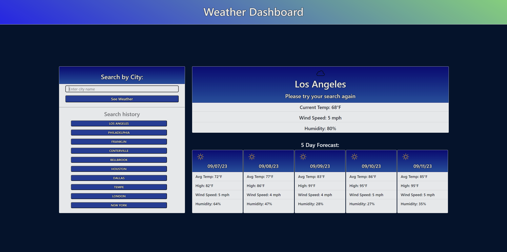

# Weather Dashboard

## Description

The purpose of this Weather Dashboard is to provide the user with a free and easy-to-use weather application. The app will display the current weather and a 5-day forecast of any city the user would like to view. This web application was designed to maximize viewing comfort on both mobile and desktop browsers.

View the 5 day forecast in any city, complete with average daily temperatures, high temperatures, wind speeds, and humidity.
The easily-accessible search history list allows users to get updates on weather in cities they've recently viewed without the need of manually searching again.

To visit the Weather Dashboard click [here!](https://prich57.github.io/weather-dashboard/)

## Installation

N/A

## Usage

To use this weather dashboard, enter the name of a city to view the current weather and 5 day forecast for that city. The input field is not case sensitive but does require the name of the city to be spelled correctly in order to display the weather.

For each city searched by the user, the Search History field will update with the most recent 8 searches, beginning with the most recent at the top of the list. The user may click on any of the buttons in the search history list to display that city's weather again. When the user has searched more than 8 times, the oldest search will be removed from the bottom of the list to maintain a maximum of 8 items in the search history at a time.

## Mock-Up

The following image shows the Weather Dashboard's appearance and functionality.

## Credits

All weather data displayed is dynamically updated through the use of the OpenWeatherMaps API

## License

TBD